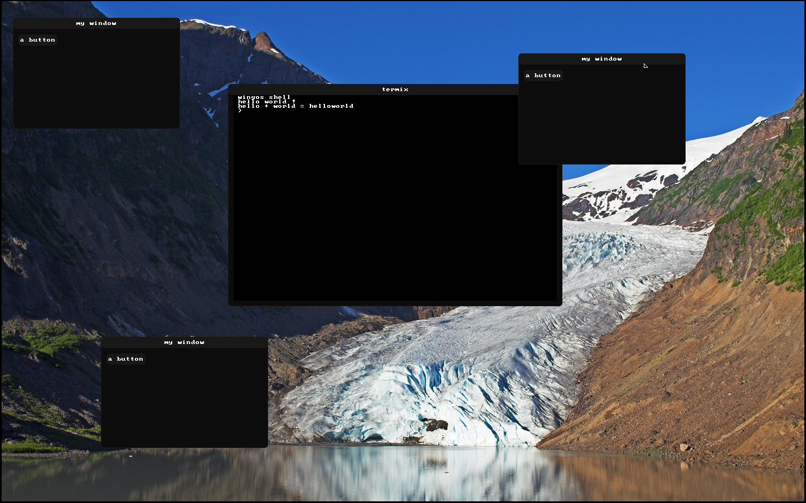

<div align="center">
<br>
<br>
<br>
<p align="center">🪦🪦🪦</p>
<p align="center">WingOS</p>
<p align="center">2020-2021</p>
<p align="center">
"Long live <a href="https://github.com/brutal-org/brutal">BRUTAL</a>!"
</p>
<br>
<br>
<br>
 
 
 


----

# Wingos

 [](./LICENSE)
 [](https://www.codacy.com/gh/Supercip971/WingOS/dashboard?utm_source=github.com&amp;utm_medium=referral&amp;utm_content=Supercip971/WingOS&amp;utm_campaign=Badge_Grade)

WingOS was a small hobbyist 64 bit kernel made with <3 in C++ 

</div>

## Contact 

- Email: supercyp@protonmail.com

- Discord server: [xK8jEswcyx](https://discord.gg/xK8jEswcyx)
## Try it

If you just want to try the os **without building** it, you can just install Qemu, and grab the latest Artifacts in the github action.

Configuration for running qemu: 

[MEMORY] : recommended memory: 4G | minimum: 2G

[CPU_CORES] : recommended : 6 | minimum : 1 (warning: 1 cpu core is really slow)
```sh
qemu-system-x86_64 -m [MEMORY] -s -device pvpanic -smp [CPU_CORES] -serial stdio -enable-kvm -d cpu_reset -d guest_errors -hda [DISK_PATH] -nic user,model=e1000 -M q35 -cpu host 
```
## Building
for building you can take a look at the [Build guide](./Build_guide.md)

## Contributing to the libutils or libc without building the kernel
if you want to contribute to the libc/libutils without having to build the kernel you can just edit the library and test it in the unit-test directory 
this is for testing the library in a linux environment 

## Supported features 

- pci
- ahci
- sata
- ata
- e1000
- syscall/sysret
- ext2fs
- smp (multi cpu)
- little gui
- basic module (for the moment we have the mouse and keyboard module in the userspace)
- basic ipc
- basic terminal
- ...

## License: 
This project use the BSD 2-Clause License  
## Screenshots:


