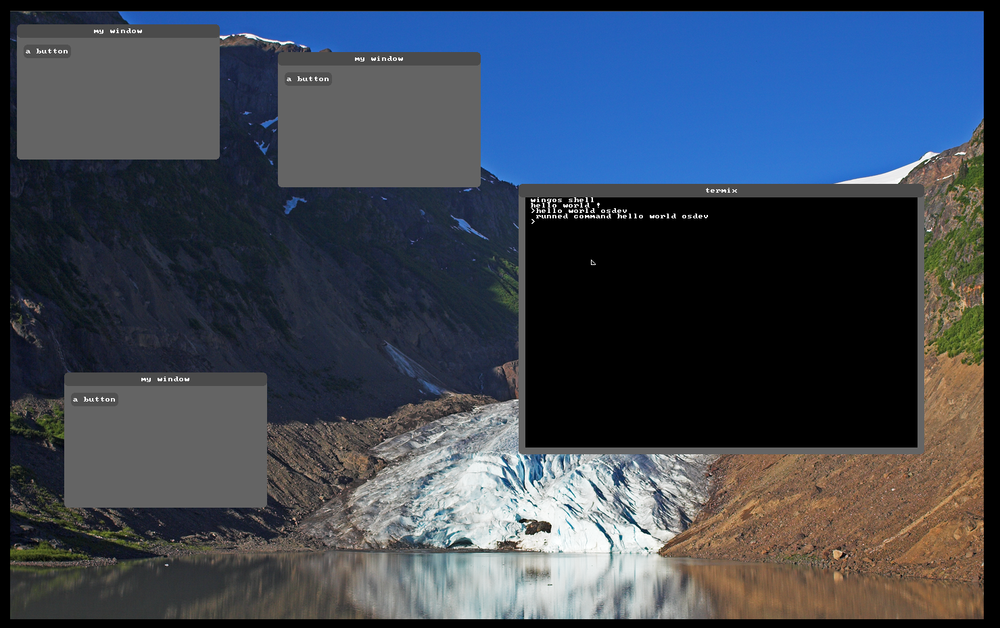

[](https://app.codacy.com/gh/Supercip971/WingOS_x64?utm_source=github.com&utm_medium=referral&utm_content=Supercip971/WingOS_x64&utm_campaign=Badge_Grade)
----
## WingOS:
WingOS is a small hobbyist 64 bit kernel made with <3 in C++ 

*oh and i'm 14 years old so sorry if the code is not the best code in the world.*
## Contact: 

Email: supercyp@protonmail.com

Discord server: [xK8jEswcyx](https://discord.gg/xK8jEswcyx)
## Try it:

if you just want to try the os **without building** it, you can just install Qemu, and grab the latest Artifacts in the github action 

configuration for running qemu: 

[MEMORY] : recommanded memory: 4G | minimum: 2G

[CPU_CORES] : recommanded : 6 | minimum : 1 (warning: 1 cpu core is really slow)
```
qemu-system-x86_64 -m [MEMORY] -s -device pvpanic -smp [CPU_CORES] -serial stdio -enable-kvm -d cpu_reset -d guest_errors -hda [DISK_PATH] -nic user,model=e1000 -M q35 -cpu host 
```
## Building:
for building you can take a look at the [Build guide](./Build_guide.md)

## Contributing to the libutils or libc without building the kernel
if you want to contribute to the libc/libutils without having to build the kernel you can just edit the library and test it in the unit-test directory 
this is for testing the library in a linux environment 

## Support: 

- PCI
- AHCI
- SATA
- ATA
- EXT2FS
- SMP (multi cpu)
- little gui 
- ...

## License: 
This project use the BSD 2-Clause License  
## Screenshots:

