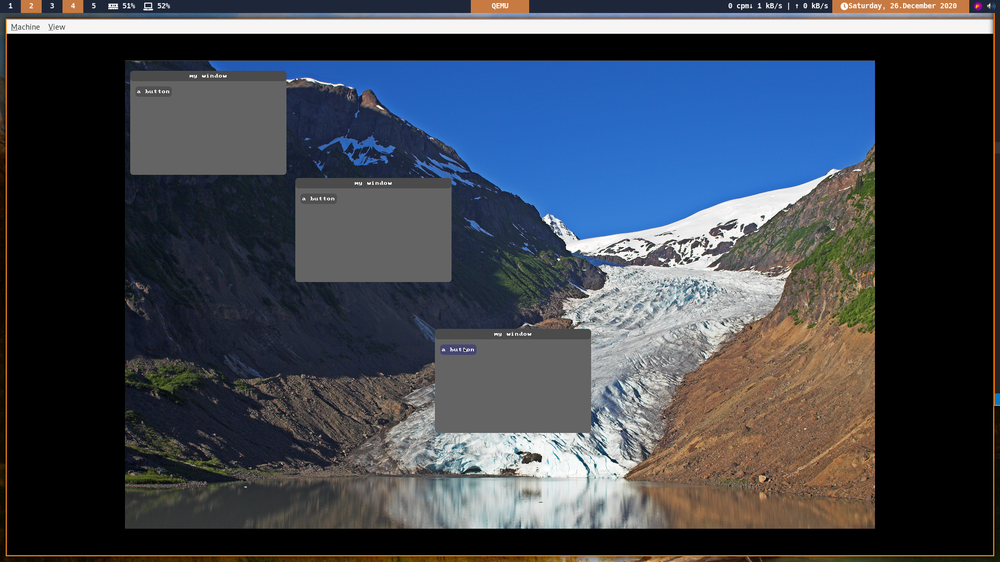

### Building
for building you can take a look at the [Build guide](./Build_guide.md)

### WingOS
WingOS is a small 64 bit kernel with SMP support and a little gui system

WingOS work with the concept of 'services'... If user app want to communicate with the kernel you can do that threw kernel services instead of syscall (for exemple the file system service). User can create / replace their own services, for exemple the graphic service in app/graphic_service. 

### Implemented things :
 - com
 - gdt
 - idt
 - *pic* / ioapic
 - paging (pmm + vmm)
 - memory (thank lib alloc)
 - smp
 - multiprocessing
 - smp multiprocessing
 - ioapic timer
 - madt 
 - apic 
 - acpi
 - basic ATA driver
 - echfs support
 - program launcher (only elf64 programs for the moment)
 - really basic pci table parser
 - process message
 - little gui system
 - ps2 mouse driver
 - basic e1000 driver
 - basic rtl8139 driver
 - AHCI support
 - Sata AHCI
 - \[insert something here]
 
 
