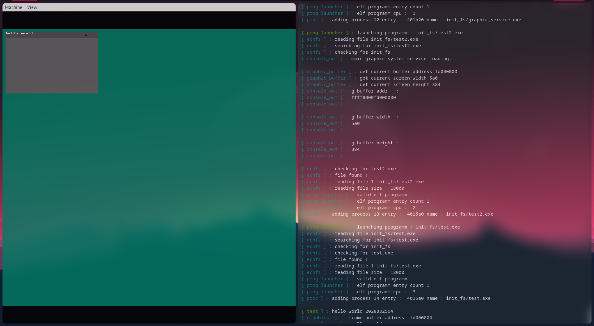

# WingOS (64 bit)

a little sample picture with a graphic app ! (with smp :^) )

## Implemented things :
 - com
 - gdt
 - idt
 - *pic* / ioapic
 - paging (pmm + vmm)
 - memory (thank lib alloc)
 - smp
 - multiprocessing
 - smp multiprocessing
 - ioapic timer
 - madt 
 - apic 
 - acpi
 - basic ATA driver
 - echfs support
 - programm launcher (only elf64 programm for the moment)
 - really basic pci table parser
 - process message
- \[insert something here]
 

